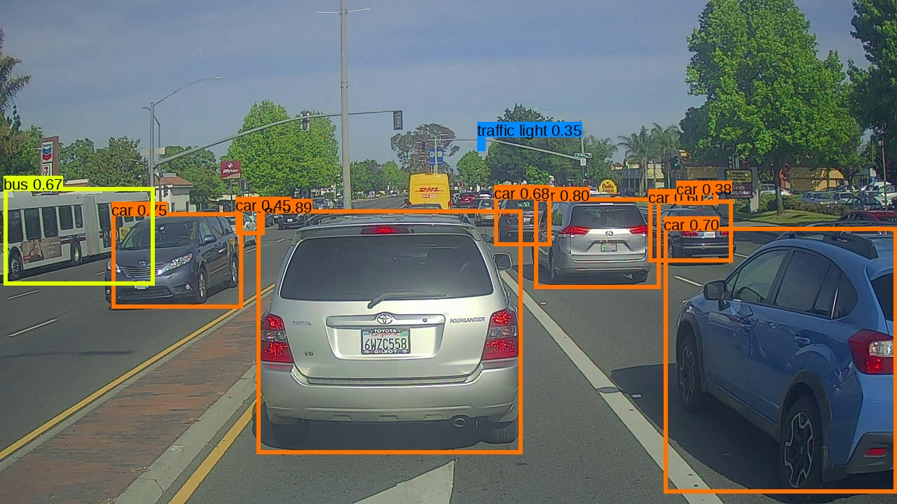

# Autonomous Driving — Car Detection 🚗⚡

**Short description**
A compact repository of detection models, utilities, and notebooks focused on car detection for autonomous driving use cases. Includes multiple YOLO variants (Keras/TensorFlow & PyTorch checkpoints), conversion/training tools, pretrained weights, sample images/videos, and an interactive notebook demo.


## 🔎 Key Features
- **Pretrained models**: YOLO (tiny, v2, v3, v5 checkpoint) and a ResNet50-based COCO model included.
- **Inference utilities**: scripts and notebooks to run detection on images, videos, or camera streams.
- **Training & conversion tools**: `yad2k` conversion/training scripts and `yolov3-tf2` training/export utilities.
- **Examples & demos**: `Autonomous_driving_application_Car_detection.ipynb` demonstrates a full detection pipeline and visualization.


## 📁 Repository structure (selected)
- `Autonomous_driving_application_Car_detection.ipynb` — Jupyter notebook demo for car detection
- `model_data/` — anchors, class lists, saved TensorFlow models
- `yad2k/` — Keras/Yolo conversion and utility scripts (`test_yolo.py`, `retrain_yolo.py`, etc.)
- `yolov3-tf2/` — TF2-based YOLOv3 (training, detection, export)
- `images/`, `nb_images/`, `videos/` — sample images and videos for testing
- Pretrained weights in root: `yolo.h5`, `yolo-tiny.h5`, `yolov2.h5`, `yolov3.h5`, `resnet50_coco_best_v2.0.1.h5`, `yolov5su.pt`
- `coco.names`, `model_data/coco_classes.txt`, `model_data/pascal_classes.txt` — class labels


## 🔧 Requirements & Installation
> Recommended: create a dedicated conda environment or venv.

Example (conda):

```bash
conda create -n yolov3 python=3.8 -y
conda activate yolov3
# For TF2 based tools
pip install -r yolov3-tf2/requirements.txt
# For yad2k / Keras-based tools (may require TF 1.x)
pip install -r yad2k/environment.yml
# Common
pip install opencv-python numpy pillow matplotlib h5py
```

Notes:
- `yad2k` and older Keras scripts often expect TensorFlow 1.x & Keras. Use a separate environment if needed.
- `yolov3-tf2` requires TensorFlow 2.x.
- For GPU acceleration, install the CUDA/cuDNN version that matches your TensorFlow build.


## 🚀 Quick Start
1. Open the notebook and run cells:
   - Open `Autonomous_driving_application_Car_detection.ipynb` in Jupyter/VS Code and run sequential cells to load models and run demos.

2. Run TF2 detection example (yolov3-tf2):

```bash
cd yolov3-tf2
python detect.py --weights ./checkpoints/yolov3.tf --image /path/to/image.jpg
python detect_video.py --weights ./checkpoints/yolov3.tf --video /path/to/video.mp4
```

3. Run Keras YOLO (yad2k) test:

```bash
python yad2k/test_yolo.py --model-path yolo.h5 --image images/test.jpg
```

## 🧪 Examples with this repo’s sample files (`images/`, `videos/`) and outputs (`out/`)

### Example input/output (from this repo)

| Input (`images/test.jpg`) | Output (`out/test.jpg`) |
| --- | --- |
|  |  |

### Detect on `images/test.jpg` and save to `out/annotated.jpg` (TF2 YOLOv3)

```bash
cd yolov3-tf2
python detect.py --weights ./checkpoints/yolov3.tf --image ..\images\test.jpg --output ..\out\annotated.jpg
```

### Detect on `videos/Test_video.mp4` and save to `out/Test_video.mp4` (TF2 YOLOv3)

```bash
cd yolov3-tf2
python detect_video.py --weights ./checkpoints/yolov3.tf --video ..\videos\Test_video.mp4 --output ..\out\Test_video.mp4
```

### (Optional) Faster model: YOLOv3-tiny, output to `out/annotated_tiny.jpg`

```bash
cd yolov3-tf2
python detect.py --tiny True --weights ./checkpoints/yolov3.tf --image ..\images\test.jpg --output ..\out\annotated_tiny.jpg
```

### Verify outputs exist (Windows PowerShell)

```powershell
dir .\out
```


## 📚 Training & Dataset
- VOC conversion scripts: `yad2k/voc_conversion_scripts/` (`voc_to_hdf5.py`, `voc_to_tfrecords.py`) to convert dataset annotations.
- `yolov3-tf2/train.py` trains YOLOv3 on TF2 (read `yolov3-tf2/README.md` for hyperparameters and dataset format).
- Typical steps: prepare dataset → convert annotations → train with appropriate config → monitor mAP / losses.


## ✅ Evaluation & Metrics
Use standard object detection metrics:
- mAP (mean Average Precision) at IoU thresholds (e.g., 0.5)
- Precision / Recall, F1-score
Tools in `yolov3-tf2` include evaluation helpers; otherwise export predictions and evaluate with COCO/PASCAL tools.


## 🧩 Models included
- `yolo.h5`, `yolo-tiny.h5` — Keras YOLO models
- `yolov2.h5`, `yolov3.h5` — YOLO variants
- `resnet50_coco_best_v2.0.1.h5` — ResNet50 COCO model
- `yolov5su.pt` — PyTorch checkpoint (when present)

If you add custom weights, update scripts' `--weights` / `--model-path` arguments accordingly.


## 🔧 Troubleshooting & Tips
- Version mismatches: confirm TF1.x vs TF2 expectations and use distinct environments.
- GPU: ensure CUDA and cuDNN match TF version.
- Memory: reduce batch size for large models if VRAM is limited.
- If detection results are missing boxes, check class labels and confidence thresholds in the script/notebook.


## 🤝 Contributing
- Fork → branch → PR with clear description and tests/examples
- Open issues for bugs or feature requests
- Respect dataset and third-party licenses when contributing data or models
